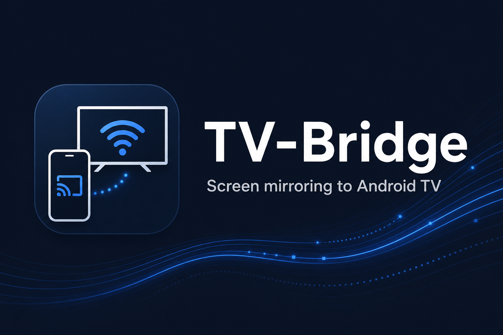
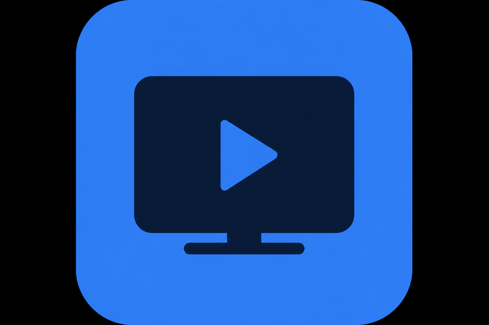
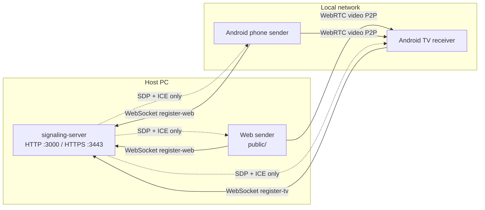

<p align="center">
  
</p>

<p align="center">
  
</p>

<h1 align="center">TV-Bridge</h1>

<p align="center">
  <strong>Self-hosted, zero-cost screen mirroring to Android TV over WebRTC.</strong><br>
  No cloud. No subscription. Video flows peer-to-peer on your LAN.
</p>

<p align="center">
  <a href="LICENSE"></a>
  <a href="https://nodejs.org"></a>
  <a href="https://developer.android.com"></a>
</p>

---

TV-Bridge lets you mirror a **PC browser** or **Android phone** to any **Android TV** on the same Wi‑Fi network. A lightweight Node.js signaling server coordinates WebRTC; the actual video stream never passes through a third-party cloud.

## Features

- **Browser sender** — open a URL, pick a TV, share your screen with `getDisplayMedia()`
- **Android phone sender** — native app with screen capture, audio, and QR/link pairing
- **Android TV receiver** — Jetpack Compose for TV, D-Pad friendly setup, fullscreen playback
- **Self-hosted signaling** — single `npm start`, only the `ws` dependency (+ auto-generated dev HTTPS certs)
- **P2P video** — low-latency WebRTC between sender and TV; server relays SDP/ICE only
- **Offline-first LAN** — works without internet once devices share a network (STUN may use Google’s public server for NAT traversal)

## Architecture



| Module | Role |
|--------|------|
| [`signaling-server/`](signaling-server/) | WebSocket registry, TV list broadcast, static web UI, optional APK download |
| [`android-tv-receiver/`](android-tv-receiver/) | WebRTC **answerer** on Android TV |
| [`android-phone-sender/`](android-phone-sender/) | WebRTC **offerer** from Android screen capture |
| [`assets/`](assets/) | Logo, banner, and brand palette |

## Installation

**Full step-by-step guide:** [INSTALLATION.md](INSTALLATION.md) — signaling server, TV receiver, phone sender, firewall, HTTPS, and troubleshooting.

## Quick start (< 2 minutes)

### 1. Start the signaling server

**Windows (PowerShell):**

```powershell
cd signaling-server
npm install
npm start
```

**macOS / Linux:**

```bash
cd signaling-server
npm install
npm start
```

The server listens on:

| URL | Purpose |
|-----|---------|
| `http://localhost:3000` | Web UI (desktop browsers) |
| `https://localhost:3443` | Web UI over HTTPS (required for some mobile browsers) |

On first run, a **self-signed TLS certificate** is generated automatically for HTTPS.

### 2. Connect Android TV

1. Install and open **TV-Bridge** on your Android TV ([build from source](android-tv-receiver/README.md)).
2. Enter the **host IP address** where the server runs (e.g. `192.168.1.100`) and a room name (e.g. `Living Room`).
3. Tap **Connect and wait for stream**.

### 3. Send your screen

**From a PC browser** — open `http://<host-ip>:3000`, select the TV, and click to share your screen.

**From an Android phone** — install the [phone sender app](android-phone-sender/README.md), point it at the same host, pick a TV, and start casting.

## Repository layout

```
tv-bridge/
├── signaling-server/       # Node.js signaling + web sender UI
├── android-tv-receiver/    # Android TV app (Kotlin, Compose for TV)
├── android-phone-sender/     # Android phone sender (Kotlin, Compose)
├── assets/                   # Brand images and SVG marks
├── INSTALLATION.md           # Full setup guide
├── LICENSE                   # MIT
├── CODE_OF_CONDUCT.md
└── CONTRIBUTING.md
```

## Signaling protocol

All clients speak JSON over WebSocket on the same port as the HTTP server.

| Direction | Message | Description |
|-----------|---------|-------------|
| TV → server | `register-tv` | Register display name |
| Server → TV | `registered` | Assigns unique `id` |
| Sender → server | `register-web` | Join as emitter |
| Server → senders | `tv-list` | Live list of connected TVs |
| Either → server | `signal` | Relay WebRTC offer, answer, or ICE |

WebRTC payloads use `{ kind: "offer" \| "answer" \| "ice-candidate", ... }`. Video is **never** proxied by the server.

## Requirements

| Component | Requirement |
|-----------|-------------|
| Signaling server | Node.js 18+ |
| Web sender | Chrome, Edge, or Firefox with `getDisplayMedia` |
| Android TV receiver | Android TV / Google TV, API 24+, same LAN as host |
| Android phone sender | Android 7+, screen-capture permission |

## Building Android apps

| App | Guide |
|-----|-------|
| TV receiver | [android-tv-receiver/README.md](android-tv-receiver/README.md) |
| Phone sender | [android-phone-sender/README.md](android-phone-sender/README.md) |

Release APKs for the phone sender can be built with the included open-source keystore (community sideload only — see [signing docs](android-phone-sender/signing/README.md)).

## Brand assets

Logos, banner, and color tokens live in [`assets/`](assets/). See [assets/README.md](assets/README.md) for the palette and file list.

<p align="center">
  
</p>

## Comparison

TV-Bridge targets a specific niche: **browser or phone → Android TV**, fully self-hosted. Unlike cloud-based cast solutions, nothing leaves your network except optional STUN lookups.

| Project | Direction | Self-hosted |
|---------|-----------|-------------|
| **TV-Bridge** | PC / phone → Android TV | Yes |
| [GlassLink](https://github.com/orlandoascanio/GlassLink) | Mac → Android TV | Yes |
| [Laplace](https://github.com/adamyordan/laplace) | Browser → browser | Yes |
| [ScreenStream](https://github.com/dkrivoruchko/screenstream) | Android → browser | Partial (cloud signaling) |

## Contributing

Contributions are welcome! Please read [CONTRIBUTING.md](CONTRIBUTING.md) and [CODE_OF_CONDUCT.md](CODE_OF_CONDUCT.md) before opening a pull request.

## License

This project is licensed under the [MIT License](LICENSE).
